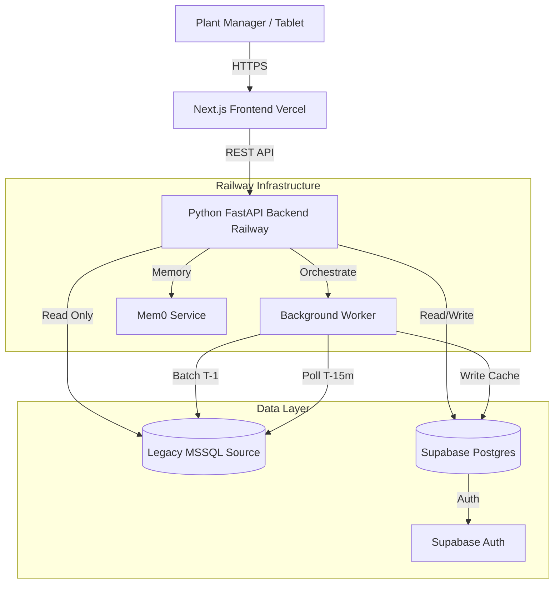

# Manufacturing Performance Assistant - Fullstack Architecture

## 1. Introduction
This document outlines the complete fullstack architecture for the **Manufacturing Performance Assistant**. It follows a **Modular Monolith** pattern within a **TurboRepo Monorepo**, combining a high-performance **Next.js** frontend with a robust **Python (FastAPI)** backend hosted on **Railway**.

### Change Log
| Date | Version | Description | Author |
| :--- | :--- | :--- | :--- |
| 2026-01-05 | 1.0 | Initial Architecture | Architect Agent |
| 2026-01-15 | 1.1-1.6 | Voice Briefing Extension | Architect Agent |
| 2026-01-15 | 2.0 | Architecture Sharding | Architect Agent |

### Architecture Document Index

This architecture is organized into focused documents:

| Document | Purpose |
|----------|---------|
| **[architecture.md](./architecture.md)** (this file) | Core platform architecture (Sections 1-9) |
| **[architecture/voice-briefing.md](./architecture/voice-briefing.md)** | Voice Briefing Extension - decisions, structure, integration |
| **[architecture/implementation-patterns.md](./architecture/implementation-patterns.md)** | Code patterns & consistency rules for AI agents |
| **[architecture/validation-results.md](./architecture/validation-results.md)** | Validation, readiness assessment, implementation handoff |

---

## 2. High Level Architecture
### Technical Summary
The system utilizes a **"Sidebar" Architecture**. The **Next.js** frontend handles the UI/UX and client-side state, serving as the "Command Center." It communicates via REST API with a **Python (FastAPI)** backend hosted on **Railway**. This backend is the system's brain, managing the connection to the legacy **MSSQL** database (read-only), the **Supabase** application database, and the **Mem0** memory service. It orchestrates the daily batch ingestion (T-1) and the high-frequency polling (T-15m).

### Platform & Infrastructure
*   **Frontend Hosting:** **Vercel** (Recommended for Next.js optimization) or Railway (if unified hosting preferred).
*   **API/Backend Hosting:** **Railway**. Selected for native Python support, easy Docker containerization, and persistent background worker capabilities (for polling).
*   **Database:** **Supabase** (PostgreSQL) for App Data, Auth, and Vector Storage.
*   **Source Data:** **Microsoft SQL Server** (On-Prem/Cloud). Connected via secure read-only credentials.

### Architecture Diagram


## 3. Tech Stack
| Category | Technology | Version | Purpose | Rationale |
| :--- | :--- | :--- | :--- | :--- |
| **Repo Structure** | TurboRepo | Latest | Monorepo Orchestration | Manages FE/BE in one place, standardizes tooling. |
| **Frontend** | Next.js | 14+ (App Router) | UI Framework | React Server Components, SSR for dashboards, robust routing. |
| **Styling** | Tailwind CSS + Shadcn/UI | Latest | UI Library | "Industrial Clarity" design, accessible, fast development. |
| **Backend** | Python | 3.11+ | API & Logic | Native ecosystem for AI (LangChain) and Data (Pandas). |
| **API Framework** | FastAPI | 0.109+ | REST API | High performance, auto-documentation (Swagger), async support. |
| **AI Orchestration** | LangChain | Latest | AI Logic | Manages prompt chains and Text-to-SQL logic. |
| **AI Memory** | Mem0 | Latest | Context Memory | Stores long-term user context and asset history. |
| **App Database** | PostgreSQL | 15+ (Supabase) | App Data | Relational data + pgvector for AI + Auth built-in. |
| **Source Driver** | pyodbc / SQLAlchemy | Latest | MSSQL Connection | Industry standard for connecting Python to SQL Server. |
| **Task Queue** | ARQ or Celery | Latest | Background Jobs | Handles the 15-minute polling without blocking API. |

## 4. Repository Structure (TurboRepo)
```text
manufacturing-assistant/
├── apps/
│   ├── web/                    # Next.js Frontend
│   │   ├── src/app/            # App Router pages
│   │   ├── src/components/     # Shadcn UI components
│   │   └── ...
│   └── api/                    # Python FastAPI Backend
│       ├── app/
│       │   ├── api/            # Endpoints
│       │   ├── core/           # Config, Security
│       │   ├── services/       # Biz Logic (Ingestion, AI)
│       │   └── main.py         # Entry point
│       ├── Dockerfile          # Railway Deployment config
│       └── requirements.txt
├── packages/                   # (Optional) Shared config
├── turbo.json                  # Turbo pipeline config
└── README.md
```

## 5. Data Models & Plant Object Model
To synthesize insights, we map raw MSSQL data to a semantic **Plant Object Model** in Supabase.

### A. The Plant Object Model (Supabase)
*   **`assets`**:
    *   `id`: UUID
    *   `name`: String (e.g., "Grinder 5")
    *   `source_id`: String (Map to MSSQL `locationName`)
    *   `area`: String (e.g., "Grinding")
*   **`cost_centers`**:
    *   `id`: UUID
    *   `asset_id`: FK -> `assets.id`
    *   `standard_hourly_rate`: Decimal (For financial calc)
*   **`shift_targets`**:
    *   `id`: UUID
    *   `asset_id`: FK
    *   `target_output`: Integer

### B. Analytical Cache (Supabase)
*   **`daily_summaries`**: Stores the T-1 processed report (OEE, Waste, Financial Loss).
*   **`live_snapshots`**: Stores the latest 15-min poll data (ephemeral or time-series).
*   **`safety_events`**: Persistent log of all detected "Safety Issue" codes.

## 6. Data Pipelines
### Pipeline A: The "Morning Report" (Batch)
*   **Trigger:** Daily at 06:00 AM (via Railway Cron).
*   **Process:**
    1.  Fetch T-1 Data (24h) from MSSQL.
    2.  Cleanse Data (Handle `NaN`, `0`).
    3.  Calculate OEE & Financial Loss using `cost_centers`.
    4.  Generate "Smart Summary" text via LLM.
    5.  Store in `daily_summaries`.

### Pipeline B: The "Live Pulse" (Polling)
*   **Trigger:** Every 15 Minutes (via Python Background Scheduler).
*   **Process:**
    1.  Fetch last 30 mins data (rolling window) from MSSQL.
    2.  Check for `reason_code = 'Safety Issue'`.
        *   *If Found:* Trigger Alert entry in `safety_events`.
    3.  Calculate current Output vs Target.
    4.  Update `live_snapshots`.

## 7. AI & Memory Architecture
*   **Mem0 Integration:**
    *   **Storage:** Stores "User Sessions" and "Asset Histories".
    *   **Usage:** When User asks *"Why does Grinder 5 keep failing?"*, Mem0 retrieves past resolutions linked to "Grinder 5".
*   **Action Engine Logic:**
    *   Input: `daily_summaries` + `safety_events` + `cost_centers`.
    *   Logic: Filter for Safety > 0 OR OEE < Target OR Financial Loss > Threshold.
    *   Sort: By Safety First, then Financial Impact ($).
    *   Output: JSON List of Actions.

## 8. Security & Constraints
*   **MSSQL Access:** The API uses a specific `RO_User` (Read-Only) account.
*   **API Security:** All endpoints protected via **Supabase Auth** (JWT validation in FastAPI dependency).
*   **Environment Variables:** Managed via Railway Secrets (Production) and `.env` (Local).

## 9. Development Workflow
*   **Local:**
    *   `apps/web`: `npm run dev` (localhost:3000)
    *   `apps/api`: `uvicorn app.main:app --reload` (localhost:8000)
*   **Deployment:**
    *   Push to Main -> TurboRepo builds Web -> Deploys to Vercel/Railway.
    *   Railway detects `apps/api` changes -> Builds Docker image -> Deploys.

---

## Feature Extensions

### Voice Briefing Extension

The Voice Briefing feature extends the core platform with ElevenLabs TTS/STT, shift handoffs, and offline capabilities.

**Full documentation:** [architecture/voice-briefing.md](./architecture/voice-briefing.md)

**Key decisions:**
- Dual delivery pattern (text primary, audio enhancement)
- ElevenLabs Flash v2.5 for TTS, Scribe v2 for STT
- Hybrid RBAC (Supabase RLS + service-level filtering)
- Service Worker + IndexedDB for offline handoffs

---

## Implementation Resources

- **Code Patterns:** [architecture/implementation-patterns.md](./architecture/implementation-patterns.md)
- **Validation & Readiness:** [architecture/validation-results.md](./architecture/validation-results.md)

---

**Architecture Status:** READY FOR IMPLEMENTATION

**Document Maintenance:** Update this architecture and its shards when major technical decisions are made during implementation.
