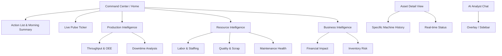

# UI/UX Specification: Manufacturing Performance Assistant

## 1. Introduction
This document defines the user experience goals, information architecture, and visual design specifications for the **Manufacturing Performance Assistant**. It serves as the blueprint for the frontend development, ensuring a "zero-latency" insight experience for Plant Managers.

### Change Log
| Date | Version | Description | Author |
| :--- | :--- | :--- | :--- |
| 2026-01-05 | 1.0 | Initial MVP Draft | UX Expert Agent |

## 2. Overall UX Goals & Principles
### Target User Personas
*   **The Plant Manager (Strategic):** Reviewer of the "Morning Report." Needs the **Daily Action List** immediately to direct morning meetings. Values Financial impact and Plant-wide OEE.
*   **The Line Supervisor (Tactical):** Floor-walker with a tablet. Needs the **"Live Pulse"** to see specific machine status. Values Asset details and specific Downtime Codes.

### Usability Goals
*   **"Glanceability":** Status must be readable from 3 feet away on a tablet.
*   **Trust & Transparency:** Every AI recommendation must visually link to raw data evidence.
*   **Zero-Training Interface:** Natural language chat interactions; no SQL knowledge required.

### Design Principles
1.  **Action First, Data Second:** Landing screen leads with the **Prioritized Action List**. Supporting data (graphs) appears as context, not the lead.
2.  **Insight + Evidence:** Action items are presented as cards: Recommendation (Left) + Supporting Metric/Chart (Right).
3.  **Visual Context Switching:** Clear visual distinction between **Retrospective** (Static/Cool colors) and **Live** (Pulsing/Vibrant indicators) modes.
4.  **Industrial High-Contrast:** "Safety Red" is reserved exclusively for incidents. High contrast for visibility under factory lighting.

## 3. Information Architecture (IA)
### Site Map

